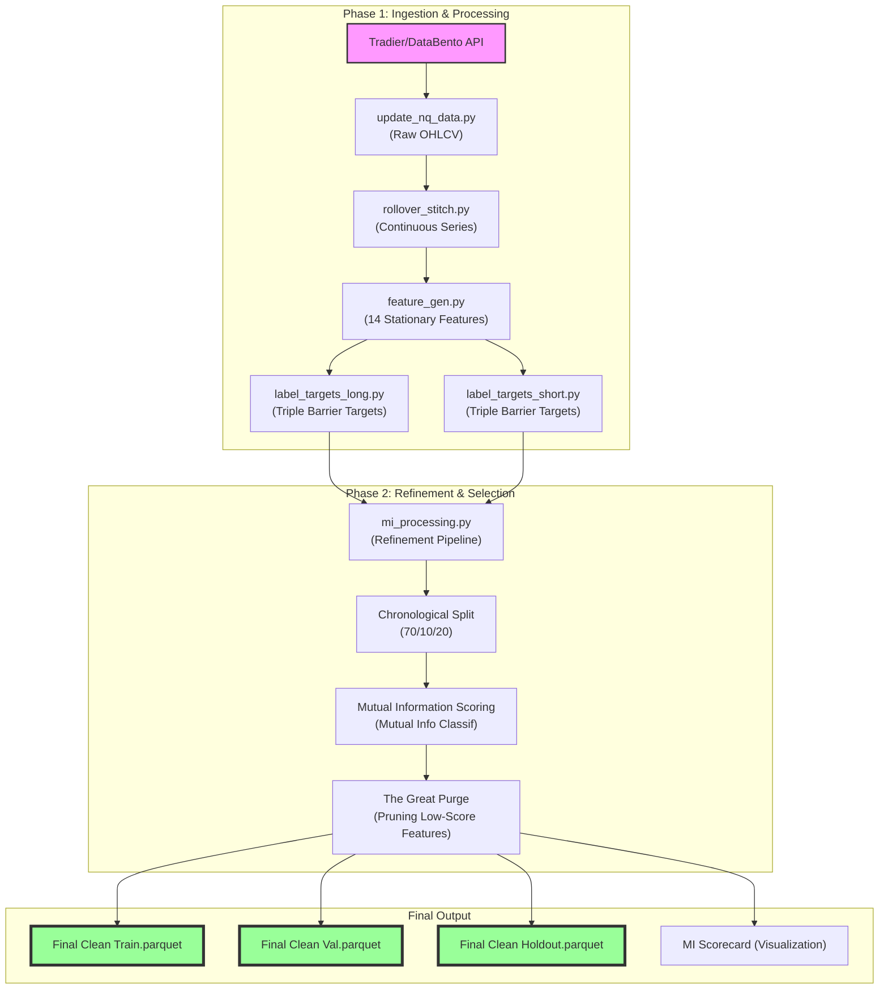

# Quant Lab Data Flow

### Tool Summary
1.  **Ingestion (`update_nq_data.py`)**: Fetches raw 1-minute OHLCV data.
2.  **Continuity (`rollover_stitch.py`)**: Resolves contract gaps to create a seamless timeline.
3.  **Features (`feature_gen.py`)**: Transforms raw prices into stationary ML features.
4.  **Labeling (`label_targets_*.py`)**: Generates classification targets via Triple Barrier Method.
5.  **Refinement (`mi_processing.py`)**: Handles the split, calculates importance, and prunes the noise.
